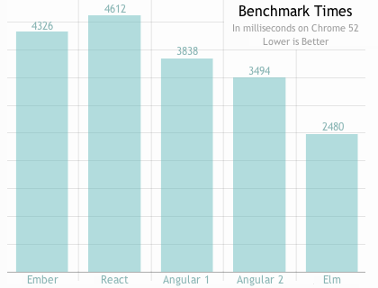
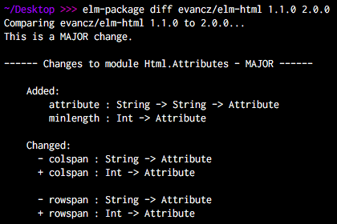
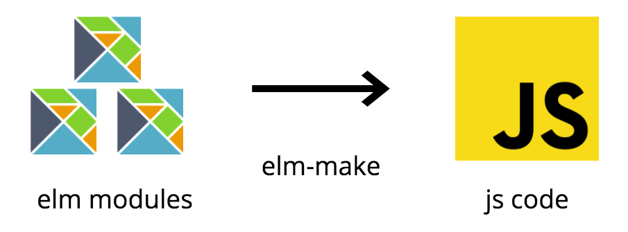
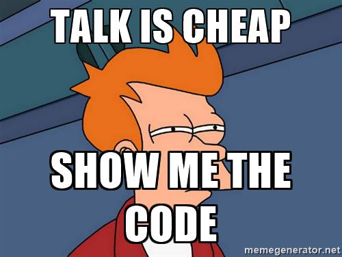

<!-- $theme: default -->

# Intro to Elm


*"Generate JavaScript with
__great performance__ and no __runtime exceptions__."*

---

# JavaScript

* __runtime exceptions__

---

# `undefined is not a function`


---

# JavaScript

* runtime exceptions
* __dynamic types__

---

# Dynamic Types

```js
users.get('user1234')
 .then(user => {
   console.log(user.name.toUpperCase())
 })
```

`user.name` exists?

Maybe is `user.firstName`, `user.fullName`...

---

# JavaScript

* runtime exceptions
* dynamic types
* __bad error handling__

---

# Bad Error Handling

```js
users.get('user1234')
 .then(user => {
   console.log(user.name.toUpperCase())
 })
```

Where is the `.catch`?


---

# Why Elm?

* __no runtime exceptions__

---

# Why Elm?

* no runtime exceptions
* __great performance__

---

# Fast Rendering


source: http://elm-lang.org/

---

# Why Elm?

* no runtime exceptions
* great performance
* __nice error messages__

---

# Nice Error Messages


---

# Nice Error Messages


---

# Why Elm?

* no runtime exceptions
* great performance
* nice error messages
* __time travel debugger__

---

# Why Elm?

* no runtime exceptions
* great performance
* nice error messages
* time travel debugger
* __automatic semver__

---

Automatic semver enforcement with
# elm-package



---

# Why Elm?

* no runtime exceptions
* great performance
* nice error messages
* time travel debugger
* automatic semver
* __easy start__

---

# Easy Start

| JavaScript        | Elm      |
|-------------------|----------|
| Immutable.js      | built in |
| TypeScript / Flow | built in |
| React             | built in |
| Redux             | built in |
| Webpack           | built in |
| npm / yarn        | built in |

---

# What is Elm?

* __compiles to javascript__

---

# Compiles to JavaScript


---

# What is Elm?

* compiles to javascript
* __statically typed__

---

# Statically Typed

* "if it compiles, it usually just works"
* cheaper refactoring -> less technical debt

---

# Why is Elm different from TypeScript?

---

```
var account = '123456'
var message = 'account is *' + account.substr(3)
alert(message)
```
---

```
var account:string = '123456'
var message:string = 'account is *' + account.substr(3)
alert(message)
```

---

```
var account:string = 123456
var message:string = 'account is *' + account.substr(3)
alert(message)
```
It doesn't compile!

---

# In TypeScript we can use `any`


---

```
var account:any = 123456
var message:string = 'account is *' + account.substr(3)
alert(message)
```

---

Now it compiles!


---

# Runtime exception

`Uncaught TypeError: account.substr is not a function`


---


# What is Elm?
* compiles to javascript
* statically typed
* __purely functional__

---

# State

All the __information__ of your application at a given instant in time.

---

# Side effects

Changes made to the __external world__.

---

Every Elm program is composed of

# PURE FUNCTIONS

---

# What is a pure function?

* __Given the same input, will always return the same output.__

---

# What is a pure function?

* Given the same input, will always return the same output.
* __Produces no side effects.__

---

# What is a pure function?

* Given the same input, will always return the same output.
* Produces no side effects.
* __Doesn't depend on external mutable state.__

---

Is this a pure function?

```
function addCustomer () {

  customerList.push({ name: $('#customer_name').val() })

  $('#customer_name').val('')

}
```

---

A function that __returns nothing__ can only be called for its side effects.

---

Is this a pure function?

```
function countVerifiedCustomers () {
  var count = 0

  customerList.forEach(function(customer) {
    count += customer.verified ? 1 : 0
  })

  return count
}
```
(we are returning something this time)

---

* there are not arguments
* doesn't return the __same value__ every time

---

# What happens with ...

---

```
const now = Date.now()
```
- no arguments
- each call returns a different value

---

```
const random = Math.random()
```
- no arguments
- each call returns a different value

---

# How can Elm deal with...

---

# How can Elm deal with...

* time

---

# How can Elm deal with...
* time
* randomness

---

# How can Elm deal with...
* time
* randomness
* http calls

---

# How can Elm deal with...
* time
* randomness
* http calls
* websockets

---

# How can Elm deal with...
* time
* randomness
* http calls
* websockets
* localStorage

---

# How can Elm deal with...
* time
* randomness
* http calls
* websockets
* localStorage
* ...

---

In Elm you can use...
# Commands

---


We tell the __runtime__ to execute things that involve __side effects__

---

Then the __runtime will execute them__ and feed the results back to the application.

---

Something produces a __`Cmd`__ and Elm returns a __`Msg`__

---

Elm is an __effect manager__ for the __EVERYTHING__
* Generate a random number
* Make an http request
* Save something into local storage
* ...

---

# Do you need a random number?

You ask for the random using a __`Cmd`__

`Random.generate`

And Elm returns them to you in a __`Msg`__


---

# Functions that involve side-effects in Elm are:

* easily understood
* easily testable (data in, data out)
* easily identified by their return type: `Cmd`

---

# Commands can come from

* `Html` - the user, event in the HTML
* `Cmd` - your code, returning Cmd from a function
* `Sub` - a subscription, time, websocket...

---



---

# Elm syntax
* __Functions__

---

## Anonymous function

```elm
\x -> x + 1

\x y -> x + y
```
---

## Named function

```elm
add : Int -> Int -> Int
add x y =
  x + y
```
The first line in the example is the __function signature__ (optional)
The rest is the __implementation__ of the function

---

## No arguments

```elm
name =
  "Sam"
```
A function that takes no arguments is a __constant__ in Elm

---

## How functions are applied

```elm
add 5 2 -- result 7
```

---

We can think is a function that takes two integers and returns another integer

---

This is not quite true in Elm, all functions take exactly __one argument__ and return __a result__

---

When we do:

```elm
add 5 2
```

This is evaluated as:

```elm
((add 5) 2)
```

---

The reason we can avoid writing the parenthesis is because function application __associates to the left__.

---

Partial application

```elm
add5 = add 5

add5 2 -- result 7
```

---

Generic functions

```elm
indexOf : String -> List String -> Int

indexOf : a -> List a -> Int
```

Any lowercase identifier can be used for type variables.

The following signature is perfectly valid:

```elm
indexOf : thing -> List thing -> Int
```

---

# Elm syntax
* Functions
* __Modules__

---

Import a module
```elm
import Html

import Html exposing (div)

import Html exposing (..)
```
---

Module declarations
```elm
module Main exposing (..)
```
Elm expects to find this module in a file called __`Main.elm`__

---

# Elm syntax
* Functions
* Modules
* __Union types__

---

Union Types are used for many things

```elm
type Answer = Yes | No
```

The `Answer` type can be `Yes` or `No`.


---

Use it in function signatures

```elm
respond : Answer -> String
respond answer =
    case answer of
      Yes ->
        ...
      No ->
        ...
```

---

Union types can have associated information with them:

```elm
type Answer = Yes | No | Other String

Other "Hello"
```

---

Nesting

```elm
type OtherAnswer = DontKnow | Perhaps | Undecided

type Answer = Yes | No | Other OtherAnswer
```

---

# Elm syntax
* Functions
* Modules
* Union types
* __Records & Type Alias__

---

Record definition:

```elm
{ id : Int
, name : String
}
```

---

You can use it in function signatures:

```elm
label: { id : Int, name : String } -> String
```

---

Using a __type alias__:
```elm
type alias Player =
    { id : Int
    , name : String
    }

label: Player -> String
```

---

# The Elm architecture


---

## Imports

```elm
import Html exposing (Html, br, button, div, text)
import Html.Events exposing (onClick)
```

---

## Model

```elm
type alias Model =
    { count : Int }

init : (Model, Cmd Msg)
init =
    ({ count = 0 }, Cmd.none)
```

---

## Messages

```elm
type Msg
    = Increment
    | Decrement

```
---

## View

```elm
view : Model -> Html Msg
view model =
    div []
        [ button [ onClick Increment ] [ text "+" ]
        , br [] []
        , text (toString model.count)
        , br [] []
        , button [ onClick Decrement ] [ text "-" ]
        ]
```

---

## Update

```elm
update : Msg -> Model -> (Model, Cmd Msg)
update msg model =
    case msg of
        Increment ->
            ({ count = model.count + 1 }, Cmd.none)

        Decrement ->
            ({ count = model.count - 1 }, Cmd.none)
```

---

## Program

```elm
main : Program Never Model Msg
main =
    Html.program
        { init = init
        , view = view
        , update = update
        , subscriptions = (\_ -> Sub.none)
        }
```

---

# Run it in a live editor

https://ellie-app.com/3d8p6NV4dyGa1/0

---

# In Elm nothing can be null / undefined


---

```
var users = ['John']
var firstUser = users[0]
console.log(firstUser.toUpperCase())
```

---

```
var users = []
var firstUser = users[0]
console.log(firstUser.toUpperCase())
```
Runtime exception:
`Uncaught TypeError: Cannot read property 'toUpperCase' of undefined`

---

In the JavaScript world __anything__ can be
# null
so you have to add defensive programming in __everywhere__:
```
var users = []
var firstUser = users[0]
if (firstUser) {
  console.log(firstUser.toUpperCase())
}
```

---

In Elm if something can be null, we use
# Maybe

---

`Maybe` is a union type...

```
type Maybe a
    = Just a
    | Nothing
```

Represents values that may or may not exist.

---

```
users = ["John"]
firstUser = List.head users

case firstUser of
  Nothing
    -- ... the list was empty

  Just value ->
    -- ... succeed with value
```

---

# bye runtime exceptions!


---

# Let's play with Elm!


---

# Installation

```
npm install -g elm
```

---

# Elm tools

* elm-repl
* elm-package
* elm-make
* elm-reactor

---

# Editors

* [Vim](https://github.com/ElmCast/elm-vim)
* [Atom](https://atom.io/packages/language-elm)
* [IntelliJ](https://github.com/durkiewicz/elm-plugin)
* [Sublime Text](https://packagecontrol.io/packages/Elm%20Language%20Support)
* [VS Code](https://github.com/sbrink/vscode-elm)

more info: https://guide.elm-lang.org/install.html

---


---

# Sources
* [elm-lang by Evan Czaplicki](http://elm-lang.org/)
* [Elm in production by Richard Feldman](https://www.youtube.com/watch?v=XsNk5aOpqUc)
* [Elm Tutorial by @sebasporto](https://www.gitbook.com/book/sporto/elm-tutorial/details)
* [An Exploration of Elm by Daniel Walker](https://github.com/plaxdan/fcip-elm)
* [Toward a Better Front End Architecture by Jeremy Fairbank](https://www.youtube.com/watch?v=EDp6UmaA9CM)

---

# EOF
